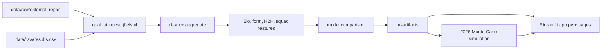

# GOAL AI

Open-source FIFA World Cup 2026 prediction lab: match probabilities, player analytics, and Monte Carlo bracket odds in Streamlit.


## Quick Start

```bash
pip install -r requirements_app.txt
python scripts/bootstrap.py
streamlit run app.py
```

If artifacts are missing, rebuild them:

```bash
pip install -r ml/requirements.txt
python ml/scripts/run_pipeline.py
```

## What It Does

- Uses `jfjelstul/worldcup` as the primary historical World Cup source.
- Keeps auxiliary international results for non-World Cup context when present.
- Trains and compares logistic regression, XGBoost, LightGBM, PyTorch, and a stack.
- Simulates the 2026 48-team format with Poisson scorelines from Elo and form.
- Ships Streamlit pages for dashboard, prediction, teams, players, model, bracket, and custom simulations.

## Architecture



## Data Credits

Primary historical data: `jfjelstul/worldcup` (mirrored locally under `data/raw/external_repos/jfjelstul_worldcup`). Reference 2026 fixture/simulation material is mirrored from:

- `PoolJinez/WORLDCUP-Tournament-2026`
- `EhteshamBahoo/Fifa-WorldCup-Data-Analysis-1930-2026`
- `zvizdo/fifa-wc-2026-simulation`

The raw evidence mirror includes a manifest at `data/raw/external_repos/SOURCE_MANIFEST.md`.

## Trade-Offs

Poisson scorelines assume independent team goal counts; future Dixon-Coles correction is planned for low-score correlation. The bundled demo artifacts are frozen at training time; `render.yaml` documents a weekly Render cron path for refreshing the model and Supabase tables.
