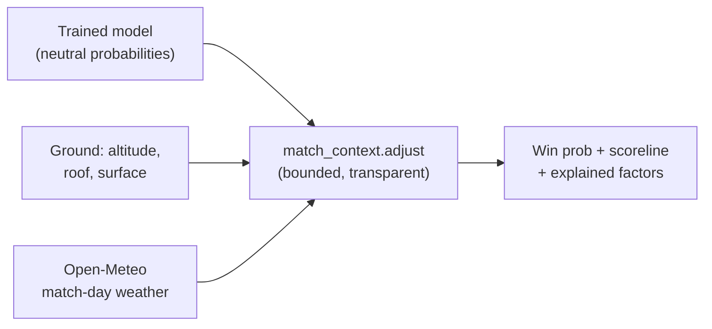

# GOAL AI ⚽

A multi-competition football intelligence and machine-learning lab, built with Streamlit.
Projects are grouped by competition so World Cup and Premier League data, models, and workflows
stay in context.


## Project groups

### FIFA World Cup 2026

1. **Player Analysis** - single-player real-data profile, peer percentiles, squad rank.
2. **Team Analysis** - Elo trajectory, recent form, squad-derived strength, match history.
3. **Player Head to Head** - compare two players with real roster/event-derived indices.
4. **Team Head to Head** - form/squad comparison plus all-time meeting record.
5. **Match Analysis + Predictor** - who wins, factoring the **football ground**, its **conditions**
   (altitude, roof, surface) and the **predicted match-day weather** for the chosen FIFA 2026 venue.

### Premier League

1. **Transfer Value Predictor** - train a linear model on player goals, assists, minutes, age, and
   position, then compare predicted and recorded transfer values.
2. **Match Outcome Predictor** - train a leakage-safe random forest on historical results, rolling
   attack/defence, recent form, and home advantage; predict win, draw, or loss for a future fixture.
3. **Player Scouting System** - search for a player, find their nearest statistical matches, and use
   K-means to organize players into playing-style clusters.

All three open with clearly labelled generated starter data. Upload a licensed CSV for real player
analysis. The match project can also pull completed Premier League fixtures from football-data.org
using `requests`; set `FOOTBALL_DATA_API_KEY` in `.env` or paste a key into the app.

## Quick start

```bash
pip install -r requirements_app.txt
python ml/scripts/fetch_fifa_data.py   # pull the latest open FIFA data (no keys needed)
python ml/scripts/fetch_2026_squads.py # build the approved 2026 player pool
python scripts/validate_real_data_sources.py
python ml/scripts/build_schedule.py    # build the 2026 fixture list (104 matches)
streamlit run app.py
```

If the model artifacts under `ml/artifacts/` are missing, rebuild them:

```bash
pip install -r ml/requirements.txt
python ml/scripts/run_pipeline.py
```

## How match prediction works


```mermaid
flowchart LR
    model["Trained model<br/>(neutral probabilities)"] --> adj
    venue["Ground: altitude,<br/>roof, surface"] --> adj
    wx["Open-Meteo<br/>match-day weather"] --> adj
    adj["match_context.adjust<br/>(bounded, transparent)"] --> out["Win prob + scoreline<br/>+ explained factors"]
```

The base trained model produces venue-neutral probabilities; a **bounded** adjustment layer tilts
them for host advantage, altitude, heat/humidity, rain (wet pitch) and wind — and explains every
shift. Weather comes from Open-Meteo (live forecast within ~16 days, otherwise a multi-year
climatology). See [`docs/research.md`](docs/research.md) for the full data-source catalogue.

## Data

World Cup primary sources: `martj42/international_results` (matches, scorers, shootouts),
`jfjelstul/worldcup` (World Cup matches, squads, players, events and stadiums), curated 2026
host venues, and Open-Meteo weather. EA Sports FC, SOFIFA and other video-game datasets are
excluded. Premier League match and squad metadata can come from football-data.org; richer player
and event metrics must be supplied from an appropriately licensed dataset. The World Cup
implementation roadmap is in [`data/FIFA_2026_REAL_DATASET_ROADMAP.md`](data/FIFA_2026_REAL_DATASET_ROADMAP.md).
