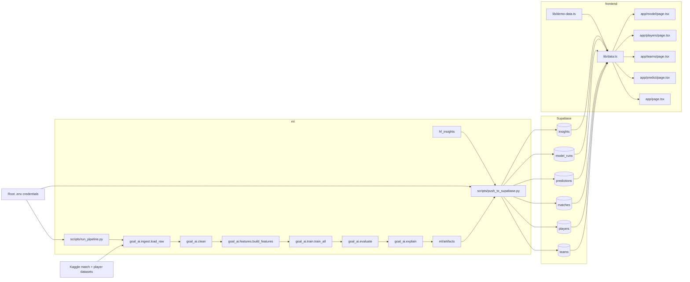

# Graphify

Generated for `.` on 2026-04-20.

## System Graph



## Directory Map

```text
.
|-- README.md
|-- docs/
|   |-- setup.md
|   |-- research.md
|   `-- graphify.md
|-- supabase/
|   |-- schema.sql
|   `-- seed.sql
|-- ml/
|   |-- config.yaml
|   |-- scripts/
|   |   |-- run_pipeline.py
|   |   `-- push_to_supabase.py
|   |-- src/goal_ai/
|   |   |-- ingest.py
|   |   |-- clean.py
|   |   |-- features.py
|   |   |-- train.py
|   |   |-- evaluate.py
|   |   |-- explain.py
|   |   |-- predict.py
|   |   |-- hf_insights.py
|   |   `-- supabase_io.py
|   `-- artifacts/
`-- frontend/
    |-- app/
    |   |-- page.tsx
    |   |-- predict/page.tsx
    |   |-- teams/page.tsx
    |   |-- players/page.tsx
    |   `-- model/page.tsx
    |-- components/
    |-- lib/
    |   |-- data.ts
    |   |-- supabase.ts
    |   `-- demo-data.ts
    `-- types/
```

## Notes

- Training flow is `ingest -> clean -> features -> train -> evaluate -> explain`.
- `push_to_supabase.py` publishes model outputs, seeded teams/players, predictions, and Hugging Face summaries.
- `frontend/lib/data.ts` is the main read layer; it uses Supabase when configured and falls back to demo data when not.
