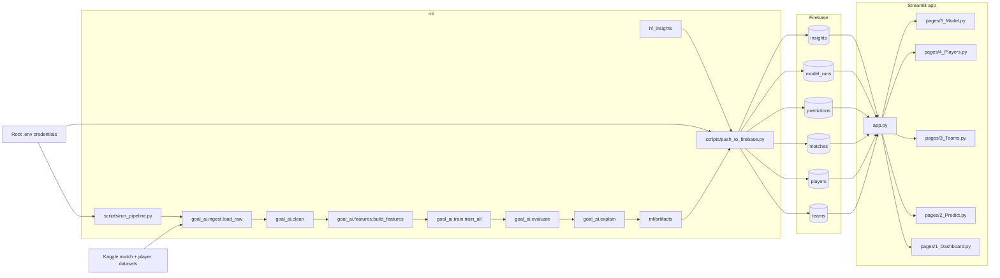

# Graphify

Generated for `.` on 2026-04-20. Updated 2026-05-01 (frontend consolidated to Streamlit; Next.js removed).

## System Graph



## Directory Map

```text
.
|-- README.md
|-- app.py
|-- requirements_app.txt
|-- pages/
|   |-- 1_Dashboard.py
|   |-- 2_Predict.py
|   |-- 3_Teams.py
|   |-- 4_Players.py
|   `-- 5_Model.py
|-- docs/
|   |-- setup.md
|   |-- research.md
|   `-- graphify.md
|-- firebase/
|   |-- schema.sql
|   `-- seed.sql
`-- ml/
    |-- config.yaml
    |-- scripts/
    |   |-- run_pipeline.py
    |   `-- push_to_firebase.py
    |-- src/goal_ai/
    |   |-- ingest.py
    |   |-- clean.py
    |   |-- features.py
    |   |-- train.py
    |   |-- evaluate.py
    |   |-- explain.py
    |   |-- predict.py
    |   |-- hf_insights.py
    |   `-- firebase_io.py
    `-- artifacts/
```

## Notes

- Training flow is `ingest -> clean -> features -> train -> evaluate -> explain`.
- `push_to_firebase.py` publishes model outputs, seeded teams/players, predictions, and Hugging Face summaries.
- The Streamlit app (`app.py` + `pages/`) reads from Firebase directly via `firebase-admin`.
- Deployment: Streamlit Cloud (frontend) + Render (backend pipeline / cron).
