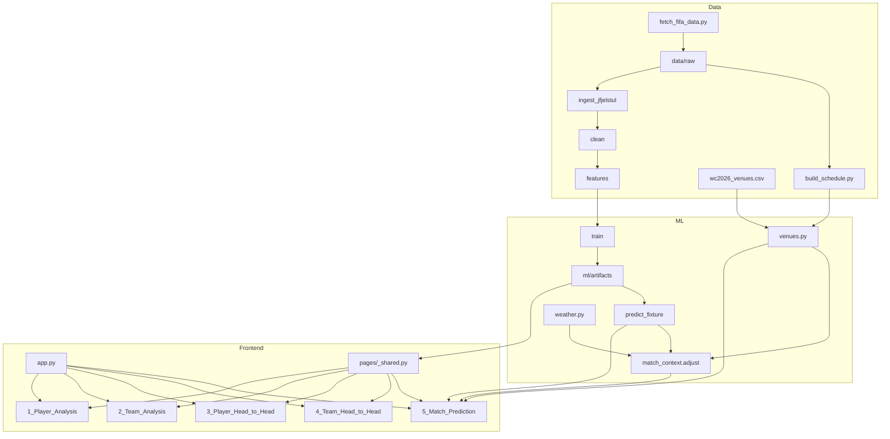

# Knowledge Graph (graphify) snapshot — GOAL AI

```mermaid
flowchart TB
    subgraph Data
        raw[data/raw]
        fetch[fetch_fifa_data.py]
        sched[build_schedule.py]
        venuescsv[wc2026_venues.csv]
        ingest[ingest_jfjelstul]
        clean[clean]
        features[features]
    end

    subgraph ML
        train[train]
        artifacts[ml/artifacts]
        predict[predict_fixture]
        venues[venues.py]
        weather[weather.py]
        context[match_context.adjust]
    end

    subgraph Frontend
        appentry[app.py]
        shared[pages/_shared.py]
        p1[1_Player_Analysis]
        p2[2_Team_Analysis]
        p3[3_Player_Head_to_Head]
        p4[4_Team_Head_to_Head]
        p5[5_Match_Prediction]
    end

    fetch --> raw
    raw --> ingest
    raw --> sched
    sched --> venues
    venuescsv --> venues
    ingest --> clean
    clean --> features
    features --> train
    train --> artifacts

    artifacts --> shared
    shared --> p1
    shared --> p2
    shared --> p3
    shared --> p4
    shared --> p5
    appentry --> p1
    appentry --> p2
    appentry --> p3
    appentry --> p4
    appentry --> p5

    artifacts --> predict
    predict --> p5
    venues --> p5
    weather --> context
    venues --> context
    predict --> context
    context --> p5
```

## Pages (5)

1. **Player Analysis** — single-player attributes, peer percentiles, value, squad rank.
2. **Team Analysis** — Elo trajectory, recent form, squad strength, match history.
3. **Player Head-to-Head** — two-player radar overlay, per-attribute winner, verdict.
4. **Team Head-to-Head** — form/squad comparison + all-time meeting record.
5. **Match Prediction** — venue-, ground- and weather-aware win probability for a chosen
   2026 fixture (model baseline + bounded `match_context` adjustment + Open-Meteo weather).

## Key modules

- `ml/src/goal_ai/predict.py` — trained-model outcome probabilities (neutral).
- `ml/src/goal_ai/venues.py` — 2026 host venues + schedule loaders.
- `ml/src/goal_ai/weather.py` — Open-Meteo match-day weather (forecast / climatology).
- `ml/src/goal_ai/match_context.py` — bounded, explained ground+weather adjustment.
- `ml/scripts/fetch_fifa_data.py` — pull open FIFA data (no keys).
- `ml/scripts/build_schedule.py` — openfootball 2026 JSON → `wc2026_schedule.csv`.
